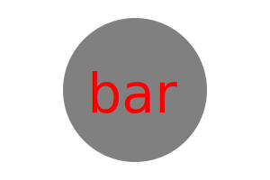
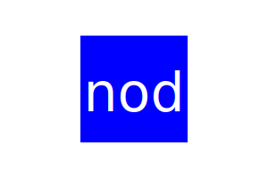

# Module 10 Challenge - SVG Generator

The SVG Generator creates logos through the command line.

https://www.youtube.com/watch?v=gXLoms27KOQ

## Features

- Creates SVG images of shapes with colors, and text.
    Shapes: Circle, Square, and Triangle.
    Text: No longer than 3 characters.
    Color: Of your choosing.

## Usage

While in VS Code or Command Prompt, run "node index.js" and follow the prompts. Once entered, an SVG file will be generated with the desired inputs.

## Examples

Circle:
  

Triangle:
  

Square:
  

## License

MIT License

## Author

Adrian Daniel Tapia / AdrianxDaniel
(Under Guidance of Instructors Speed Run)